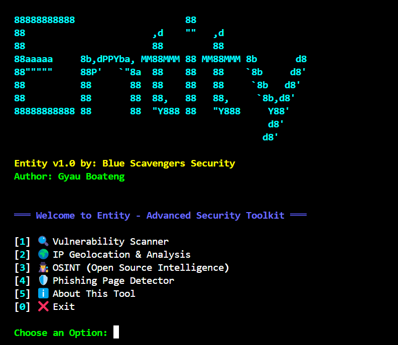

# Entity - Advanced Security Toolkit



[](https://github.com/UnknownNinja99/Scavengers-Entity)
[](https://github.com/UnknownNinja99/Scavengers-Entity)
[](https://python.org)
[](SECURITY.md)
[](LICENSE)
[](https://github.com/UnknownNinja99/Scavengers-Entity)

**Entity v1.0** by **Blue Scavengers Security** is a comprehensive, command-line cybersecurity toolkit designed for educational purposes, security professionals, and ethical hackers in Python.

---

## 🚀 Features

Entity combines multiple powerful security tools into a single, user-friendly interface.

### 1. 🔍 Vulnerability Scanner
- **Multi-threaded Port Scanning**: Quickly discover open ports on a target.
- **Banner Grabbing**: Identify services running on open ports.
- **Web Vulnerability Analysis**: Check for missing security headers, directory listing, and basic SQLi/XSS vulnerabilities.
- **SSL/TLS Certificate Analysis**: Inspect SSL certificates for expiration, weak algorithms, and misconfigurations.
- **Directory & File Enumeration**: Discover common sensitive directories and files.

### 2. 🕵️ OSINT (Open Source Intelligence) Suite
- **Social Media OSINT**: Check for a username's presence across major social media platforms.
- **Domain/IP Intelligence**: Gather detailed information on domains and IP addresses.
- **Phone Number Intelligence**: Analyze phone numbers to find the country, carrier, and type.
- **Email Investigation**: Gather intelligence on an email address and its domain.
- **Username Search**: Perform a broad search for a username across dozens of platforms.
- **Automatic Data Breach Check**: Check if an email has been exposed in known data breaches using the HaveIBeenPwned API.
- **WHOIS Lookup**: Perform a detailed WHOIS lookup on any domain.

### 3. 🛡️ Phishing Page Detector
- **URL Analysis**: Scans URLs for suspicious keywords, excessive length, and other structural red flags.
- **Domain Analysis**: Checks domain age and reputation.
- **Risk Scoring**: Provides an overall risk score to determine the likelihood of a phishing attempt.
- **Bulk Analysis**: Analyze a list of URLs at once.

### 4. 🌍 IP Geolocation & Analysis
- **IP Geolocation**: Track the geographical location of public IP addresses.
- **Private IP Handling**: Intelligently identifies private IPs and provides local network context.
- **Bulk IP Analysis**: Analyze multiple IP addresses in a single run.

---

## 🛠️ Installation

Entity supports **all major platforms** with tested, optimized installation procedures:

### 🖥️ Windows
```cmd
git clone https://github.com/UnknownNinja99/Scavengers-Entity.git
cd Scavengers-Entity
install.bat
# OR manual: pip install -r requirements.txt && python main.py
```

### 🐧 Linux (Ubuntu/Debian/Kali)
```bash
apt install git
apt install python3
git clone https://github.com/UnknownNinja99/Scavengers-Entity.git
cd Scavengers-Entity

# Create a virtual environment for Entity
python3 -m venv entity-env

# Activate it
source entity-env/bin/activate

# Install packages (now it will work!)
pip install requests rich phonenumbers python-whois pyfiglet

# Run Entity
python main.py
```
📖 **Detailed guide:** [LINUX-INSTALL.md](LINUX-INSTALL.md)

### 📱 Termux (Android)
```bash
pkg update && pkg upgrade
pkg install git
pkg install python
git clone https://github.com/UnknownNinja99/Scavengers-Entity.git
cd Scavengers-Entity
python3 -m pip install requests rich phonenumbers python-whois pyfiglet
python main.py
```
📖 **Detailed guide:** [TERMUX-INSTALL.md](TERMUX-INSTALL.md)

### ✅ Platform Compatibility

| Platform | Status | Installation Method | Notes |
|----------|--------|-------------------|-------|
| 🖥️ **Windows** | ✅ Fully Supported | `install.bat` or pip | Native support |
| 🐧 **Linux** | ✅ Fully Supported | Virtual environment | Modern distributions |
| 📱 **Termux** | ✅ Fully Supported | Termux-optimized packages | Android compatible |
| 🍎 **macOS** | ✅ Should Work | Standard pip install | Not extensively tested |

### Manual Installation (All Platforms)

1.  **Clone the repository:**
    ```bash
    git clone https://github.com/UnknownNinja99/Scavengers-Entity.git
    cd Scavengers-Entity
    ```

2.  **Install the required dependencies:**
    Make sure you have Python 3.7+ installed. Then run:
    ```bash
    pip install -r requirements.txt
    ```

3.  **Run Entity:**
    ```bash
    python main.py
    ```

# Clone and install Entity
git clone https://github.com/UnknownNinja99/Scavengers-Entity.git
cd Scavengers-Entity
pip install -r requirements.txt

# Run Entity
python main.py
```

---

## 🖥️ Usage

To run the toolkit, simply execute the `main.py` script:

```bash
python main.py
```

You will be greeted with the main menu, where you can choose from the available modules.

---

## 📚 Documentation

- **[QUICKSTART.md](QUICKSTART.md)** - Fast setup and basic usage
- **[SETUP.md](SETUP.md)** - Detailed installation guide for all platforms
- **[CONTRIBUTING.md](CONTRIBUTING.md)** - How to contribute to the project

## 🚀 Quick Usage

After installation, simply run:
```bash
python main.py
```

Or use the launcher scripts:
- Linux/macOS/Termux: `./entity.sh`
- Windows: `entity.bat`

## 🎯 Example Usage

### Safe Testing Targets
- **scanme.nmap.org** - Official Nmap test server
- **testphp.vulnweb.com** - Vulnerable web application for testing
- **Your own servers/devices** - Always the safest option

### Sample Commands
1. **Vulnerability Scan:** Select option 1, enter target IP/domain
2. **IP Geolocation:** Select option 2, enter IP address
3. **OSINT Investigation:** Select option 3, choose investigation type
4. **Phishing Detection:** Select option 4, enter suspicious URL

---

## 🤝 Contributing

We welcome contributions! Please see [CONTRIBUTING.md](CONTRIBUTING.md) for guidelines.

## 📝 License

This project is open source. Use responsibly and ethically.

## 🔗 Links

- **GitHub Repository:** [https://github.com/UnknownNinja99/Scavengers-Entity](https://github.com/UnknownNinja99/Scavengers-Entity)
- **Issues & Bug Reports:** [GitHub Issues](https://github.com/UnknownNinja99/Scavengers-Entity/issues)

## ⚖️ Disclaimer

This tool is intended for educational and authorized security testing purposes **only**. The author is not responsible for any misuse or damage caused by this program. Always obtain explicit permission before scanning any target you do not own. **Act ethically and responsibly.**