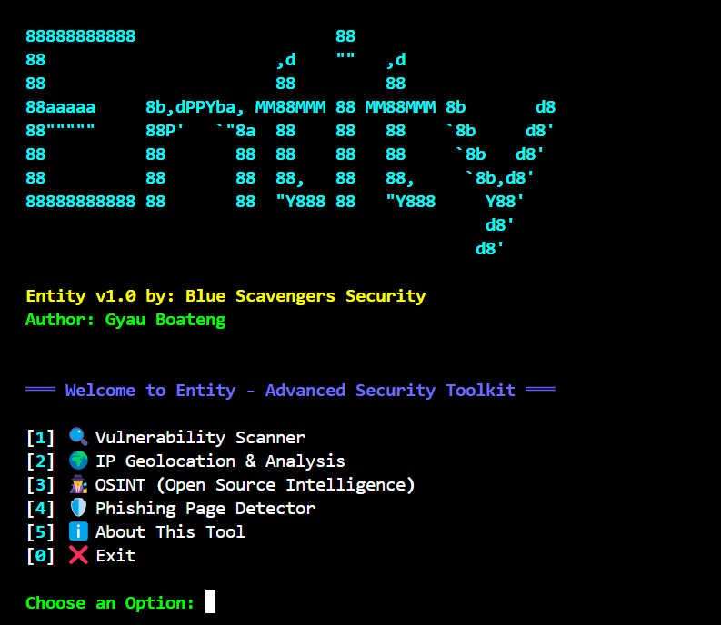

# Entity - Cybersecurity Learning Toolkit



[](https://github.com/UnknownNinja99/Scavengers-Entity)
[](https://github.com/UnknownNinja99/Scavengers-Entity)
[](https://python.org)
[](LICENSE)
[](https://github.com/UnknownNinja99/Scavengers-Entity)
[](https://education.github.com)

Entity is a Python-based cybersecurity toolkit I built to learn about network security, OSINT techniques, and ethical hacking. This project started as a learning exercise and evolved into a full-featured security assessment tool.

**What I learned building this:**
- Network programming and socket handling
- Multi-threaded port scanning algorithms
- API integration for OSINT data gathering
- Security best practices and vulnerability assessment
- Building modular, maintainable code

---

## 🚀 Features

Built this toolkit from scratch to understand how security tools work under the hood. Each feature taught me something new about cybersecurity.

### 1. 🔍 Network Vulnerability Scanner
- **Enhanced Port Scanning**: Multi-threaded scanning with support for 43+ service types (way better than my first version that only recognized 13!)
- **Smart Banner Grabbing**: Protocol-aware detection - learned the hard way that HTTP requests don't work on SMB ports
- **Service Fingerprinting**: Identifies RPC, NetBIOS, SMB, VMware services, and more
- **Vulnerability Assessment**: Flags common security issues like EternalBlue, weak encryption, open relays
- **Custom Port Ranges**: Scan specific ports or full ranges (1-65535)

### 2. 🕵️ OSINT Investigation Tools
- **Username Search**: Check username availability across 50+ social platforms
- **Email Intelligence**: Domain analysis, breach checking via HaveIBeenPwned API
- **Phone Number Analysis**: Carrier lookup, country identification, number type detection
- **WHOIS Lookup**: Domain registration info, nameservers, creation dates
- **Social Media OSINT**: Find social profiles linked to usernames or emails

### 3. 🛡️ Phishing Detection
- **URL Risk Analysis**: Checks for suspicious patterns, homograph attacks, URL shorteners
- **Domain Reputation**: Flags newly registered domains (common phishing tactic)
- **Security Headers**: Verifies if sites use proper HTTPS and security headers
- **Risk Scoring System**: Calculates overall threat level with detailed breakdown

### 4. 🌍 IP Geolocation
- **Location Tracking**: Geographic data for any public IP address
- **ISP Detection**: Identifies internet service providers
- **Local Network Handling**: Smart detection of private IP ranges (192.168.x.x, 10.x.x.x, etc.)

---

## 🛠️ Installation

Entity supports **all major platforms** with tested, optimized installation procedures:

### 🖥️ Windows
```cmd
git clone https://github.com/UnknownNinja99/Scavengers-Entity.git
cd Scavengers-Entity
install.bat
# OR manual: pip install -r requirements.txt && python main.py
```

### 🐧 Linux (Ubuntu/Debian/Kali)
```bash
apt install git
apt install python3
git clone https://github.com/UnknownNinja99/Scavengers-Entity.git
cd Scavengers-Entity

# Create a virtual environment for Entity
python3 -m venv entity-env

# Activate it
source entity-env/bin/activate

# Install packages (now it will work!)
pip install requests rich phonenumbers python-whois pyfiglet

# Run Entity
python main.py

# 🚀 For future runs, use the easy launcher:
chmod +x run-entity.sh && ./run-entity.sh
```
📖 **Detailed guide:** [LINUX-INSTALL.md](LINUX-INSTALL.md)

### 📱 Termux (Android)
```bash
pkg update && pkg upgrade
pkg install git
pkg install python
git clone https://github.com/UnknownNinja99/Scavengers-Entity.git
cd Scavengers-Entity
python3 -m pip install requests rich phonenumbers python-whois pyfiglet
python main.py
```
📖 **Detailed guide:** [TERMUX-INSTALL.md](TERMUX-INSTALL.md)

### ✅ Platform Compatibility

| Platform | Status | Installation Method | Notes |
|----------|--------|-------------------|-------|
| 🖥️ **Windows** | ✅ Fully Supported | `install.bat` or pip | Native support |
| 🐧 **Linux** | ✅ Fully Supported | Virtual environment | Modern distributions |
| 📱 **Termux** | ✅ Fully Supported | Termux-optimized packages | Android compatible |
| 🍎 **macOS** | ✅ Should Work | Standard pip install | Not extensively tested |

### Manual Installation (All Platforms)

1.  **Clone the repository:**
    ```bash
    git clone https://github.com/UnknownNinja99/Scavengers-Entity.git
    cd Scavengers-Entity
    ```

2.  **Install the required dependencies:**
    Make sure you have Python 3.7+ installed. Then run:
    ```bash
    pip install -r requirements.txt
    ```

3.  **Run Entity:**
    ```bash
    python main.py
    ```

# Clone and install Entity
git clone https://github.com/UnknownNinja99/Scavengers-Entity.git
cd Scavengers-Entity
pip install -r requirements.txt

# Run Entity
python main.py
```

---

## 🖥️ Usage

Run the main script and navigate through the interactive menu:

```bash
python entity_v2.py
```

The interface is pretty intuitive - just follow the prompts. I designed it to be beginner-friendly since I was a beginner when I started this project!

---

## 📚 Documentation

- **[QUICKSTART.md](QUICKSTART.md)** - Fast setup and basic usage
- **[SETUP.md](SETUP.md)** - Detailed installation guide for all platforms
- **[CONTRIBUTING.md](CONTRIBUTING.md)** - How to contribute to the project

## 🚀 Quick Usage

After installation, simply run:
```bash
python main.py
```

Or use the launcher scripts:
- Linux/macOS/Termux: `./entity.sh`
- Windows: `entity.bat`

## 🎯 Testing the Toolkit

### Legal & Safe Testing
**IMPORTANT:** Only scan systems you own or have explicit permission to test. Unauthorized scanning is illegal.

**Safe targets for practice:**
- `scanme.nmap.org` - Nmap's official test server
- `testphp.vulnweb.com` - Intentionally vulnerable site
- Your own local network (192.168.x.x)
- Your own VPS or cloud instances

### Quick Examples
```bash
# Port scan your local machine
1 → Network Scanner → Quick Scan → localhost

# Check if an email was in data breaches  
3 → OSINT Suite → Email Intelligence → test@example.com

# Analyze a suspicious URL
4 → Phishing Detector → Enter URL

# Geolocate an IP
2 → IP Geolocation → 8.8.8.8
```

---

## 🤝 Contributing

This started as a solo learning project, but I'd love to see what others can add! Whether it's bug fixes, new features, or documentation improvements - all contributions are welcome.

Check out [CONTRIBUTING.md](CONTRIBUTING.md) for guidelines on how to get involved.

## 🎓 Learning Resources

If you're learning cybersecurity like me, these helped a lot:
- **NetworkChuck** (YouTube) - Great networking tutorials
- **The Cyber Mentor** - Ethical hacking courses
- **OWASP Top 10** - Web security fundamentals
- **Python Socket Programming** - Official Python docs

## 📝 License

MIT License - feel free to use this for learning, modify it, or build something better!

## 🔗 Links

- **GitHub Repository:** [https://github.com/UnknownNinja99/Scavengers-Entity](https://github.com/UnknownNinja99/Scavengers-Entity)
- **Issues & Bug Reports:** [GitHub Issues](https://github.com/UnknownNinja99/Scavengers-Entity/issues)

## ⚖️ Legal Disclaimer

**READ THIS:** This toolkit is for learning and authorized testing only. I built it to understand cybersecurity concepts, not for malicious use.

- ✅ Use on your own systems
- ✅ Use with written permission
- ✅ Use on designated practice targets (like scanme.nmap.org)
- ❌ Don't scan random websites or networks
- ❌ Don't use for unauthorized access
- ❌ Don't be that person who ruins it for everyone

Unauthorized port scanning and security testing can be illegal in your jurisdiction. I'm not responsible for misuse - use common sense and ethics.

---

## 🙏 Acknowledgments

Built with help from:
- The awesome open-source community
- Various cybersecurity learning resources
- Friends who tested early versions and gave honest feedback
- Stack Overflow (let's be real, everyone uses it)

## 📬 Contact

- **GitHub Issues**: Best way to report bugs or suggest features
- **Repository**: [Scavengers-Entity](https://github.com/UnknownNinja99/Scavengers-Entity)

If this project helped you learn something new, consider giving it a star ⭐ - it motivates me to keep improving it!